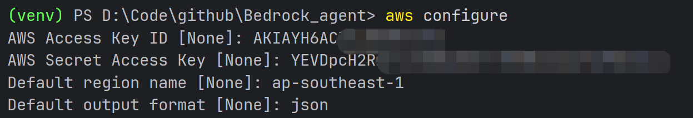

# Get started with Amazon Bedrock Agentcore

## 1. 前置条件

### 1.1 AWS账号&IAM用户账号

确保已经拥有AWS账号，且创建了IAM用户，如果还没有，需要进行注册申请；

### 1.2 Access Key信息  

1. 进入到IAM界面，在左侧导航栏选择Users，找到自己对应的账号，点击进入；
<a id="fig1"></a>
<figure>
    
</figure>
<p align="center">图1：个人用户位置</p>

2. 选择Security credentials，找到Access key，点击Create access key；
<a id="fig2"></a>
<figure>
    
</figure>
<p align="center">图2：创建秘钥</p>

3. 可以根据需要进行选择，默认选择第一项Command Line Interface(CLI)，然后确定，然后就可以得到秘钥；
<a id="fig3"></a>
<figure>
    
</figure>
<p align="center">图3：选择Use Case</p>

4. 回到Security credentials页面，就可以看到创建的Access Key ID和秘钥；
<a id="fig4"></a>
<figure>
    
</figure>
<p align="center">图4：获取ID和Key</p>

### 1.3 依赖软件安装
- 本地安装AWS CLI，安装方法见[官网指导](https://docs.aws.amazon.com/cli/latest/userguide/getting-started-install.html)；
- 安装python，版本>=3.10；
- 安装三方依赖包：
    - bedrock-agentcore
    - bedrock-agentcore-starter-toolkit>=0.1.21
    - strands-agents
    - strands-agents-tools
    - boto3

### 1.4 aws本地配置
使用命令`aws configure`进行aws本地配置，配置信息如下：
<a id="fig5"></a>
<figure>
    
</figure>
<p align="center">图5：本地aws配置</p>

- AWS Access Key ID：即为[图4](#fig4)中的Key ID；
- AWS Secret Access Key：即为执行为[图3](#fig3)获取到的Key；
- Default region name：根据自己的所有region进行配置；
- Default output format：默认为json，可以选择其他格式；

到此，agentcore本地配置的前置条件就已经完成了，下一步就可以把本地的Agent推送到Agentcore进行托管了。

## 2. 配置和部署 agent


### 2.1 创建Agent脚本
Create agentcore_starter_strands.py

本文以aws提供的[示例脚本](https://docs.aws.amazon.com/bedrock-agentcore/latest/devguide/agentcore-get-started-toolkit.html)为例进行配置，脚本如下：
```python
"""
Strands Agent sample with AgentCore
"""
import os
from strands import Agent
from strands_tools.code_interpreter import AgentCoreCodeInterpreter
from bedrock_agentcore.memory.integrations.strands.config import AgentCoreMemoryConfig, RetrievalConfig
from bedrock_agentcore.memory.integrations.strands.session_manager import AgentCoreMemorySessionManager
from bedrock_agentcore.runtime import BedrockAgentCoreApp

app = BedrockAgentCoreApp()

MEMORY_ID = os.getenv("BEDROCK_AGENTCORE_MEMORY_ID")
REGION = os.getenv("AWS_REGION")
MODEL_ID = "us.anthropic.claude-3-7-sonnet-20250219-v1:0"

@app.entrypoint
def invoke(payload, context):
    actor_id = "quickstart-user"

    # Get runtime session ID for isolation
    session_id = getattr(context, 'session_id', None)

    # Configure memory if available
    session_manager = None
    if MEMORY_ID:
        memory_config = AgentCoreMemoryConfig(
            memory_id=MEMORY_ID,
            session_id=session_id or 'default',
            actor_id=actor_id,
            retrieval_config={
                f"/users/{actor_id}/facts": RetrievalConfig(top_k=3, relevance_score=0.5),
                f"/users/{actor_id}/preferences": RetrievalConfig(top_k=3, relevance_score=0.5)
            }
        )
        session_manager = AgentCoreMemorySessionManager(memory_config, REGION)

    # Create Code Interpreter with runtime session binding
    code_interpreter = AgentCoreCodeInterpreter(
        region=REGION,
        session_name=session_id,
        auto_create=True
    )

    agent = Agent(
        model=MODEL_ID,
        session_manager=session_manager,
        system_prompt="""You are a helpful assistant with code execution capabilities. Use tools when appropriate.
Response format when using code:
1. Brief explanation of your approach
2. Code block showing the executed code
3. Results and analysis
""",
        tools=[code_interpreter.code_interpreter]
    )

    result = agent(payload.get("prompt", ""))
    return {"response": result.message.get('content', [{}])[0].get('text', str(result))}

if __name__ == "__main__":
    app.run()
```

此处需要注意两点：  
1. 需要确定当前所在region，配置正确的的region id，如果已经创建了memory，就可以获取到对应的memory信息；
2. MODEL_ID需要查询所在region的模型列表，获取到对应的MODEL_ID，默认的不一定跟你所在的region匹配，查询的方式如下：
```sql
aws bedrock list-foundation-models --region ap-southeast-1
```
得到的列表如[图6](#fig6)：
<a id="fig6"></a>
<figure>
    
</figure>
<p align="center">图6：模型列表</p>

可以根据返回的模型列表进行选择，获取对应模型的modelID即可。


### 2.2 agentcore配置

接下来，按照指导顺序执行：
```sql
agentcore configure -e agentcore_starter_strands.py

#Interactive prompts you'll see:

# 1. Execution Role: Press Enter to auto-create or provide existing role ARN/name
# 2. ECR Repository: Press Enter to auto-create or provide existing ECR URI
# 3. Requirements File: Confirm the detected requirements.txt file or specify a different path 
# 4. OAuth Configuration: Configure OAuth authorizer? (yes/no) - Type `no` for this tutorial
# 5. Request Header Allowlist: Configure request header allowlist? (yes/no) - Type `no` for this tutorial
# 6. Memory Configuration:
#    - If existing memories found: Choose from list or press Enter to create new
#    - If creating new: Enable long-term memory extraction? (yes/no) - Type `yes` for this tutorial
#    - Note: Short-term memory is always enabled by default
#    - Type `s` to skip memory setup
```

### 2.3 agentcore部署

将agent启动至agentcore的runtime运行环境上：
```sql
agentcore launch

# This performs:
#   1. Memory resource provisioning (STM + LTM strategies)
#   2. Docker container build with dependencies
#   3. ECR repository push
#   4. AgentCore Runtime deployment with X-Ray tracing enabled
#   5. CloudWatch Transaction Search configuration (automatic)
#   6. Endpoint activation with trace collection
```

### 2.4 agentcore监控

启动成功后，可以查看agent部署状态，命令如下：
```sql
agentcore status

# Shows:
#   Memory ID: bedrock_agentcore_memory_ci_agent_memory-abc123
#   Memory Type: STM+LTM (3 strategies) (when active with strategies)
#   Memory Type: STM only (if configured without LTM)
#   Observability: Enabled
```


## 3. agent运行测试

### 3.1 测试短期记忆
```sql
# Store information (session IDs must be 33+ characters)
agentcore invoke "{'prompt': 'Remember that my favorite agent platform is AgentCore'}"

# Retrieve within same session
agentcore invoke "{'prompt': 'What is my favorite agent platform?'}"

# Expected response:
# "Your favorite agent platform is AgentCore."

```
这里有一点需要注意，脚本里的单引号和双引号与aws的指南里有所差异，应该根据具体的执行环境进行适配修改，windows、linux、macOS稍有不同。

### 3.2 测试长期记忆

长期记忆（LTM）允许信息在不同的会话之间持续存在。这需要在开始新会话之前等待长期记忆被提取。
```sql
# Session 1: Store facts
agentcore invoke "{'prompt': 'My email is user@example.com and I am an AgentCore user'}"
```

在调用agent后，AgentCore 在后台运行以执行提取,请等待提取完成。这通常需要 10-30 秒。如果您没有看到任何结果，请再等几秒钟。

启动另外一个session：
```sql
sleep 20
# Session 2: Different runtime session retrieves the facts extracted from initial session
SESSION_ID=$(python -c "import uuid; print(uuid.uuid4())")
agentcore invoke '{"prompt": "Tell me about myself?"}' --session-id $SESSION_ID

# Expected response:
# "Your email address is user@example.com."
# "You appear to be a user of AgentCore, which seems to be your favorite agent platform."
```

### 3.3 测试代码解释
```sql
# Store data
agentcore invoke "{'prompt': 'My dataset has values: 23, 45, 67, 89, 12, 34, 56.'}"

# Create visualization
agentcore invoke "{'prompt': 'Create a text-based bar chart visualization showing the distribution of values in my dataset with proper labels'}"

# Expected: Agent generates matplotlib code to create a bar chart
```