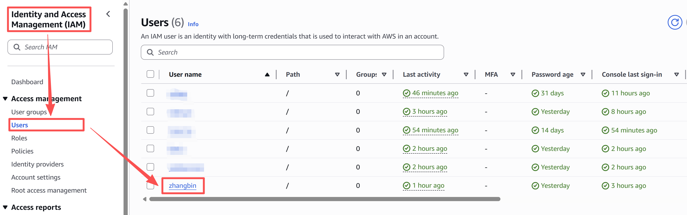
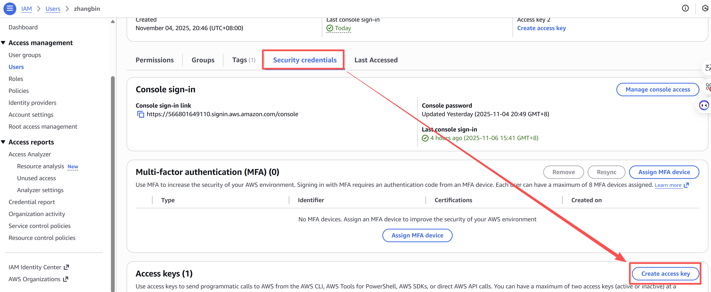
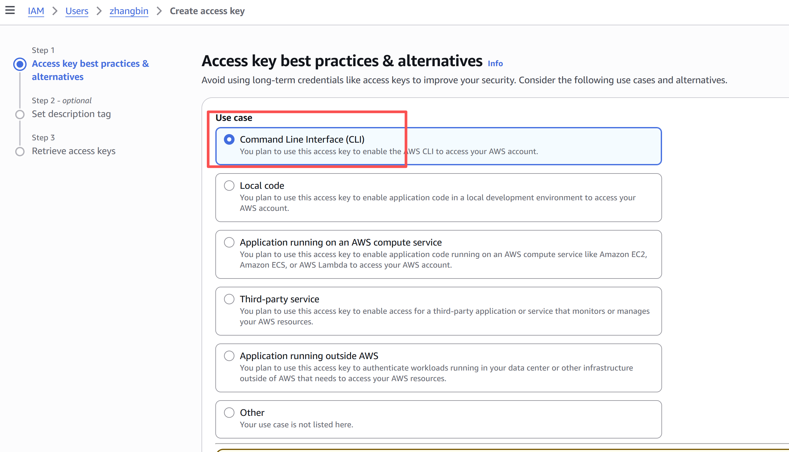
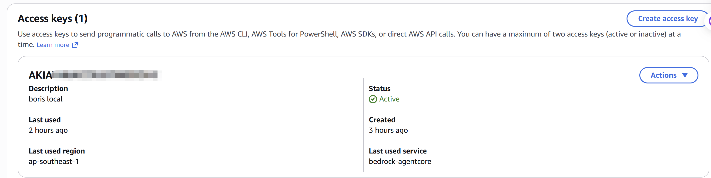

# Get started with Amazon Bedrock Agentcore

## 1. 前置条件

### 1.1 AWS账号&IAM用户账号

确保已经拥有AWS账号，且创建了IAM用户，如果还没有，需要进行注册申请；

### 1.2 Access Key信息  

1. 进入到IAM界面，在左侧导航栏选择Users，找到自己对应的账号，点击进入；
<figure>
    
    <figcaption id="fig1" style="margin-top:6px; text-align:center;">
        图1：个人用户位置
    </figcaption>
</figure>

2. 选择Security credentials，找到Access key,点击Create access key；
<figure>
    
    <figcaption id="fig2" style="margin-top:6px; text-align:center;">
        图2：创建秘钥
    </figcaption>
</figure>

3. 可以根据需要进行选择，默认选择第一项Command Line Interface(CLI)，然后确定，然后就可以得到秘钥；
<figure>
    
    <figcaption id="fig3" style="margin-top:6px; text-align:center;">
        图3：选择Use Case
    </figcaption>
</figure>

4. 回到Security credentials页面，就可以看到创建的Access Key ID和秘钥；
<figure>
    
    <figcaption id="fig4" style="margin-top:6px; text-align:center;">
        图3：获取ID和Key
    </figcaption>
</figure>

### 1.3 依赖软件安装
- 本地安装AWS CLI，安装方法见[官网指导](https://docs.aws.amazon.com/cli/latest/userguide/getting-started-install.html)；
- 